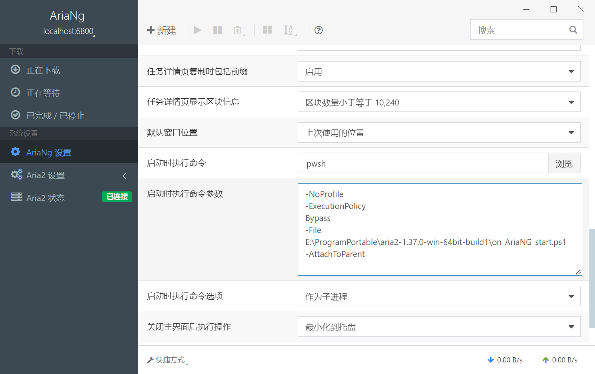

# Aria2 基本介绍

[Aria2](https://github.com/aria2/aria2)想必不用过多介绍，是一款非常强大的多协议命令行下载工具。以它为核心的 GUI 下载工具有很多，我用过的 WebUI 有[AriaNg](https://github.com/mayswind/AriaNg)、[webui-aria2](https://github.com/ziahamza/webui-aria2)，桌面端的有[Motrix](https://github.com/agalwood/Motrix)、[imfile-desktop](https://github.com/imfile-io/imfile-desktop)。

然而，这些工具各有其缺点，WebUI 需要单独挂着一个终端运行 aria2，手滑关闭终端下载就中断了；Motrix 和它的知名 fork imfile-desktop，虽然功能还行，但 Motrix 已经很久（main 分支停留在 2 年前）没有更新了，imfile-desktop 虽然还在维护，但更新极为缓慢（看 issues 说作者似乎只会更新依赖版本）。

# AriaNg Native 介绍

因为我很喜欢 AriaNg 的强大功能，但又不想每次都开终端，所以我找到了 AriaNg 官方开发的桌面端工具[AriaNg Native](https://github.com/mayswind/AriaNg-Native)。相比 AriaNg，它可以挂在系统托盘运行，不用担心误关闭终端；通过设置**启动时执行命令**，可以自动启动 aria2 服务端，相比之前方便一些。

下面我就来介绍一下我个人的 Aria2 配置，和我使用的 AriaNg Native 的启动时执行命令。

# Aria2 配置文件

文件基于[P3TERX/aria2.conf](https://github.com/P3TERX/aria2.conf)，做了一些修改，适合 Windows 平台使用。使用我的配置时，主要修改下载目录`dir`；如果需要安全性，也可以修改 RPC 的`rpc-secret`。

将下面内容保存为`aria2.conf`文件，放在 Aria2 的可执行文件同级目录即可。

```properties
#
# Cola 修改为 Windows 配置文件
#

#
# https://github.com/P3TERX/aria2.conf
# File name：aria2.conf
# Description: Awesome Aria2 configuration file
# Version: 2021.09.15
#
# Copyright (c) 2018-2021 P3TERX <https://p3terx.com>
#
# This is free software, licensed under the MIT License.
# See /LICENSE for more information.
#

## 文件保存设置 ##

# 下载目录。可使用绝对路径或相对路径, 默认: 当前启动位置
dir=E:\Downloads

# 磁盘缓存, 0 为禁用缓存，默认:16M
# 磁盘缓存的作用是把下载的数据块临时存储在内存中，然后集中写入硬盘，以减少磁盘 I/O ，提升读写性能，延长硬盘寿命。
# 建议在有足够的内存空闲情况下适当增加，但不要超过剩余可用内存空间大小。
# 此项值仅决定上限，实际对内存的占用取决于网速(带宽)和设备性能等其它因素。
disk-cache=64M

# 文件预分配方式, 可选：none, prealloc, trunc, falloc, 默认:prealloc
# 预分配对于机械硬盘可有效降低磁盘碎片、提升磁盘读写性能、延长磁盘寿命。
# 机械硬盘使用 ext4（具有扩展支持），btrfs，xfs 或 NTFS（仅 MinGW 编译版本）等文件系统建议设置为 falloc
# 若无法下载，提示 fallocate failed.cause：Operation not supported 则说明不支持，请设置为 none
# prealloc 分配速度慢, trunc 无实际作用，不推荐使用。
# 固态硬盘不需要预分配，只建议设置为 none ，否则可能会导致双倍文件大小的数据写入，从而影响寿命。
file-allocation=none

# 文件预分配大小限制。小于此选项值大小的文件不预分配空间，单位 K 或 M，默认：5M
no-file-allocation-limit=64M

# 断点续传
continue=true

# 始终尝试断点续传，无法断点续传则终止下载，默认：true
always-resume=false

# 不支持断点续传的 URI 数值，当 always-resume=false 时生效。
# 达到这个数值从将头开始下载，值为 0 时所有 URI 不支持断点续传时才从头开始下载。
max-resume-failure-tries=0

# 获取服务器文件时间，默认:false
remote-time=true


## 进度保存设置 ##

# 从会话文件中读取下载任务
input-file=./aria2.session

# 会话文件保存路径
# Aria2 退出时或指定的时间间隔会保存`错误/未完成`的下载任务到会话文件
save-session=./aria2.session

# 任务状态改变后保存会话的间隔时间（秒）, 0 为仅在进程正常退出时保存, 默认:0
# 为了及时保存任务状态、防止任务丢失，此项值只建议设置为 1
save-session-interval=1

# 自动保存任务进度到控制文件(*.aria2)的间隔时间（秒），0 为仅在进程正常退出时保存，默认：60
# 此项值也会间接影响从内存中把缓存的数据写入磁盘的频率
# 想降低磁盘 IOPS (每秒读写次数)则提高间隔时间
# 想在意外非正常退出时尽量保存更多的下载进度则降低间隔时间
# 非正常退出：进程崩溃、系统崩溃、SIGKILL 信号、设备断电等
auto-save-interval=20

# 强制保存，即使任务已完成也保存信息到会话文件, 默认:false
# 开启后会在任务完成后保留 .aria2 文件，文件被移除且任务存在的情况下重启后会重新下载。
# 关闭后已完成的任务列表会在重启后清空。
force-save=false


## 下载连接设置 ##

# 文件未找到重试次数，默认:0 (禁用)
# 重试时同时会记录重试次数，所以也需要设置 max-tries 这个选项
max-file-not-found=10

# 最大尝试次数，0 表示无限，默认:5
max-tries=0

# 重试等待时间（秒）, 默认:0 (禁用)
retry-wait=10

# 连接超时时间（秒）。默认：60
connect-timeout=10

# 超时时间（秒）。默认：60
timeout=10

# 最大同时下载任务数, 运行时可修改, 默认:5
max-concurrent-downloads=5

# 单服务器最大连接线程数, 任务添加时可指定, 默认:1
# 最大值为 16 (增强版无限制), 且受限于单任务最大连接线程数(split)所设定的值。
max-connection-per-server=16

# 单任务最大连接线程数, 任务添加时可指定, 默认:5
split=64

# 文件最小分段大小, 添加时可指定, 取值范围 1M-1024M (增强版最小值为 1K), 默认:20M
# 比如此项值为 10M, 当文件为 20MB 会分成两段并使用两个来源下载, 文件为 15MB 则只使用一个来源下载。
# 理论上值越小使用下载分段就越多，所能获得的实际线程数就越大，下载速度就越快，但受限于所下载文件服务器的策略。
min-split-size=4M

# HTTP/FTP 下载分片大小，所有分割都必须是此项值的倍数，最小值为 1M (增强版为 1K)，默认：1M
piece-length=1M

# 允许分片大小变化。默认：false
# false：当分片大小与控制文件中的不同时将会中止下载
# true：丢失部分下载进度继续下载
allow-piece-length-change=true

# 最低下载速度限制。当下载速度低于或等于此选项的值时关闭连接（增强版本为重连），此选项与 BT 下载无关。单位 K 或 M ，默认：0 (无限制)
lowest-speed-limit=0

# 全局最大下载速度限制, 运行时可修改, 默认：0 (无限制)
max-overall-download-limit=0

# 单任务下载速度限制, 默认：0 (无限制)
max-download-limit=0

# 禁用 IPv6, 默认:false
disable-ipv6=false

# GZip 支持，默认:false
http-accept-gzip=true

# URI 复用，默认: true
reuse-uri=true

# 禁用 netrc 支持，默认:false
no-netrc=false

# 允许覆盖，当相关控制文件(.aria2)不存在时从头开始重新下载。默认:false
allow-overwrite=false

# 文件自动重命名，此选项仅在 HTTP(S)/FTP 下载中有效。新文件名在名称之后扩展名之前加上一个点和一个数字（1..9999）。默认:true
auto-file-renaming=true

# 使用 UTF-8 处理 Content-Disposition ，默认:false
content-disposition-default-utf8=false

# 最低 TLS 版本，可选：TLSv1.1、TLSv1.2、TLSv1.3 默认:TLSv1.2
#min-tls-version=TLSv1.2


## BT/PT 下载设置 ##

# BT 监听端口(TCP), 默认:6881-6999
# 直通外网的设备，比如 VPS ，务必配置防火墙和安全组策略允许此端口入站
# 内网环境的设备，比如 NAS ，除了防火墙设置，还需在路由器设置外网端口转发到此端口
listen-port=51413

# DHT 网络与 UDP tracker 监听端口(UDP), 默认:6881-6999
# 因协议不同，可以与 BT 监听端口使用相同的端口，方便配置防火墙和端口转发策略。
dht-listen-port=51413

# 启用 IPv4 DHT 功能, PT 下载(私有种子)会自动禁用, 默认:true
enable-dht=true

# 启用 IPv6 DHT 功能, PT 下载(私有种子)会自动禁用，默认:false
# 在没有 IPv6 支持的环境开启可能会导致 DHT 功能异常
enable-dht6=true

# 指定 BT 和 DHT 网络中的 IP 地址
# 使用场景：在家庭宽带没有公网 IP 的情况下可以把 BT 和 DHT 监听端口转发至具有公网 IP 的服务器，在此填写服务器的 IP ，可以提升 BT 下载速率。
#bt-external-ip=

# IPv4 DHT 文件路径，默认：$HOME/.aria2/dht.dat
dht-file-path=./dht.dat

# IPv6 DHT 文件路径，默认：$HOME/.aria2/dht6.dat
dht-file-path6=./dht6.dat

# IPv4 DHT 网络引导节点
dht-entry-point=dht.transmissionbt.com:6881

# IPv6 DHT 网络引导节点
dht-entry-point6=dht.transmissionbt.com:6881

# 本地节点发现, PT 下载(私有种子)会自动禁用 默认:false
bt-enable-lpd=true

# 指定用于本地节点发现的接口，可能的值：接口，IP地址
# 如果未指定此选项，则选择默认接口。
#bt-lpd-interface=

# 启用节点交换, PT 下载(私有种子)会自动禁用, 默认:true
enable-peer-exchange=true

# BT 下载最大连接数（单任务），运行时可修改。0 为不限制，默认:55
# 理想情况下连接数越多下载越快，但在实际情况是只有少部分连接到的做种者上传速度快，其余的上传慢或者不上传。
# 如果不限制，当下载非常热门的种子或任务数非常多时可能会因连接数过多导致进程崩溃或网络阻塞。
# 进程崩溃：如果设备 CPU 性能一般，连接数过多导致 CPU 占用过高，因资源不足 Aria2 进程会强制被终结。
# 网络阻塞：在内网环境下，即使下载没有占满带宽也会导致其它设备无法正常上网。因远古低性能路由器的转发性能瓶颈导致。
bt-max-peers=128

# BT 下载期望速度值（单任务），运行时可修改。单位 K 或 M 。默认:50K
# BT 下载速度低于此选项值时会临时提高连接数来获得更快的下载速度，不过前提是有更多的做种者可供连接。
# 实测临时提高连接数没有上限，但不会像不做限制一样无限增加，会根据算法进行合理的动态调节。
bt-request-peer-speed-limit=10M

# 全局最大上传速度限制, 运行时可修改, 默认:0 (无限制)
# 设置过低可能影响 BT 下载速度
max-overall-upload-limit=2M

# 单任务上传速度限制, 默认:0 (无限制)
max-upload-limit=0

# 最小分享率。当种子的分享率达到此选项设置的值时停止做种, 0 为一直做种, 默认:1.0
# 强烈建议您将此选项设置为大于等于 1.0
seed-ratio=1.0

# 最小做种时间（分钟）。设置为 0 时将在 BT 任务下载完成后停止做种。
seed-time=0

# 做种前检查文件哈希, 默认:true
bt-hash-check-seed=true

# 继续之前的BT任务时, 无需再次校验, 默认:false
bt-seed-unverified=false

# BT tracker 服务器连接超时时间（秒）。默认：60
# 建立连接后，此选项无效，将使用 bt-tracker-timeout 选项的值
bt-tracker-connect-timeout=10

# BT tracker 服务器超时时间（秒）。默认：60
bt-tracker-timeout=10

# BT 服务器连接间隔时间（秒）。默认：0 (自动)
#bt-tracker-interval=0

# BT 下载优先下载文件开头或结尾
bt-prioritize-piece=head=32M,tail=32M

# 保存通过 WebUI(RPC) 上传的种子文件(.torrent)，默认:true
# 所有涉及种子文件保存的选项都建议开启，不保存种子文件有任务丢失的风险。
# 通过 RPC 自定义临时下载目录可能不会保存种子文件。
rpc-save-upload-metadata=true

# 下载种子文件(.torrent)自动开始下载, 默认:true，可选：false|mem
# true：保存种子文件
# false：仅下载种子文件
# mem：将种子保存在内存中
follow-torrent=true

# 种子文件下载完后暂停任务，默认：false
# 在开启 follow-torrent 选项后下载种子文件或磁力会自动开始下载任务进行下载，而同时开启当此选项后会建立相关任务并暂停。
pause-metadata=false

# 保存磁力链接元数据为种子文件(.torrent), 默认:false
bt-save-metadata=false

# 加载已保存的元数据文件(.torrent)，默认:false
bt-load-saved-metadata=false

# 删除 BT 下载任务中未选择文件，默认:false
bt-remove-unselected-file=false

# BT强制加密, 默认: false
# 启用后将拒绝旧的 BT 握手协议并仅使用混淆握手及加密。可以解决部分运营商对 BT 下载的封锁，且有一定的防版权投诉与迅雷吸血效果。
# 此选项相当于后面两个选项(bt-require-crypto=true, bt-min-crypto-level=arc4)的快捷开启方式，但不会修改这两个选项的值。
bt-force-encryption=true

# BT加密需求，默认：false
# 启用后拒绝与旧的 BitTorrent 握手协议(\19BitTorrent protocol)建立连接，始终使用混淆处理握手。
#bt-require-crypto=true

# BT最低加密等级，可选：plain（明文），arc4（加密），默认：plain
#bt-min-crypto-level=arc4

# 分离仅做种任务，默认：false
# 从正在下载的任务中排除已经下载完成且正在做种的任务，并开始等待列表中的下一个任务。
bt-detach-seed-only=false


## 客户端伪装 ##

# 自定义 User Agent
user-agent=Mozilla/5.0 (Windows NT 10.0; Win64; x64) AppleWebKit/537.36 (KHTML, like Gecko) Chrome/93.0.4577.63 Safari/537.36 Edg/93.0.961.47

# BT 客户端伪装
# PT 下载需要保持 user-agent 和 peer-agent 两个参数一致
# 部分 PT 站对 Aria2 有特殊封禁机制，客户端伪装不一定有效，且有封禁账号的风险。
#user-agent=Deluge 1.3.15
peer-agent=Deluge 1.3.15
peer-id-prefix=-DE13F0-


## 执行额外命令 ##

# 下载停止后执行的命令
# 从 正在下载 到 删除、错误、完成 时触发。暂停被标记为未开始下载，故与此项无关。
# on-download-stop=

# 下载完成后执行的命令
# 此项未定义则执行 下载停止后执行的命令 (on-download-stop)
# on-download-complete=

# 下载错误后执行的命令
# 此项未定义则执行 下载停止后执行的命令 (on-download-stop)
#on-download-error=

# 下载暂停后执行的命令
#on-download-pause=

# 下载开始后执行的命令
#on-download-start=

# BT 下载完成后执行的命令
#on-bt-download-complete=


## RPC 设置 ##

# 启用 JSON-RPC/XML-RPC 服务器, 默认:false
enable-rpc=true

# 接受所有远程请求, 默认:false
rpc-allow-origin-all=true

# 允许外部访问, 默认:false
rpc-listen-all=true

# RPC 监听端口, 默认:6800
rpc-listen-port=6800

# RPC 密钥
# rpc-secret=

# RPC 最大请求大小
rpc-max-request-size=10M

# RPC 服务 SSL/TLS 加密, 默认：false
# 启用加密后必须使用 https 或者 wss 协议连接
# 不推荐开启，建议使用 web server 反向代理，比如 Nginx、Caddy ，灵活性更强。
#rpc-secure=false

# 在 RPC 服务中启用 SSL/TLS 加密时的证书文件(.pem/.crt)
#rpc-certificate=/root/.aria2/xxx.pem

# 在 RPC 服务中启用 SSL/TLS 加密时的私钥文件(.key)
#rpc-private-key=/root/.aria2/xxx.key

# 事件轮询方式, 可选：epoll, kqueue, port, poll, select, 不同系统默认值不同
#event-poll=select


## 高级选项 ##

# 启用异步 DNS 功能。默认：true
#async-dns=true

# 指定异步 DNS 服务器列表，未指定则从 /etc/resolv.conf 中读取。
#async-dns-server=119.29.29.29,223.5.5.5,8.8.8.8,1.1.1.1

# 指定单个网络接口，可能的值：接口，IP地址，主机名
# 如果接口具有多个 IP 地址，则建议指定 IP 地址。
# 已知指定网络接口会影响依赖本地 RPC 的连接的功能场景，即通过 localhost 和 127.0.0.1 无法与 Aria2 服务端进行讯通。
#interface=

# 指定多个网络接口，多个值之间使用逗号(,)分隔。
# 使用 interface 选项时会忽略此项。
#multiple-interface=


## 日志设置 ##

# 日志文件保存路径，忽略或设置为空为不保存，默认：不保存
log=./aria2.log

# 日志级别，可选 debug, info, notice, warn, error 。默认：debug
log-level=info

# 控制台日志级别，可选 debug, info, notice, warn, error ，默认：notice
console-log-level=notice

# 安静模式，禁止在控制台输出日志，默认：false
quiet=false

# 下载进度摘要输出间隔时间（秒），0 为禁止输出。默认：60
summary-interval=0

# 关闭控制台进度条输出，避免日志里面打印大量空行
show-console-readout=false


## 增强扩展设置(非官方) ##

# 仅适用于 myfreeer/aria2-build-msys2 (Windows) 和 P3TERX/Aria2-Pro-Core (GNU/Linux) 项目所构建的增强版本

# 在服务器返回 HTTP 400 Bad Request 时重试，仅当 retry-wait > 0 时有效，默认 false
#retry-on-400=true

# 在服务器返回 HTTP 403 Forbidden 时重试，仅当 retry-wait > 0 时有效，默认 false
#retry-on-403=true

# 在服务器返回 HTTP 406 Not Acceptable 时重试，仅当 retry-wait > 0 时有效，默认 false
#retry-on-406=true

# 在服务器返回未知状态码时重试，仅当 retry-wait > 0 时有效，默认 false
#retry-on-unknown=true

# 是否发送 Want-Digest HTTP 标头。默认：false (不发送)
# 部分网站会把此标头作为特征来检测和屏蔽 Aria2
#http-want-digest=false


## BitTorrent trackers ##
bt-tracker=
```

# AriaNg Native 启动时执行命令

在任意位置新建一个`on_AriaNG_start.ps1`文件，内容如下；这个脚本会在 AriaNg Native 启动时执行，完成两个任务：

- 下载最新的 BT trackers 列表并更新到`aria2.conf`文件中
- 启动`aria2c.exe`并加载配置文件`aria2.conf`，并且将 aria2c 进程生命周期绑定到 AriaNg Native 进程（父进程退出时终止 aria2c），间接实现作为 AriaNg Native 的子进程。（AriaNg Native 设置中的作为子进程不符合本脚本的需求）

```powershell
# 可选参数：-AttachToParent 将 aria2c 的生命周期绑定到启动本脚本的父进程（父进程退出时终止 aria2c）
param(
    [switch]$AttachToParent
)

# 设置窗口标题为 "Aria2"
try { $Host.UI.RawUI.WindowTitle = "Aria2" } catch {}

# 锁定到脚本所在目录，保证相对路径可用
$ScriptDir = Split-Path -Path $MyInvocation.MyCommand.Path -Parent
Set-Location -Path $ScriptDir

# 配置文件路径和下载链接
$ConfigFilePath = Join-Path -Path $ScriptDir -ChildPath "aria2.conf"
$TrackersFileName = "trackers_best.txt"
# $TrackersDownloadUrl = "https://raw.githubusercontent.com/ngosang/trackerslist/master/$TrackersFileName"
# 使用 kkgithub.com 以提高国内访问速度
$TrackersDownloadUrl = "https://raw.kkgithub.com/ngosang/trackerslist/master/$TrackersFileName"
$TempTrackersFilePath = Join-Path -Path $env:TEMP -ChildPath $TrackersFileName

${updateSucceeded} = $false

try {
    # 下载 trackers 文件
    Write-Host "Downloading trackers file from $TrackersDownloadUrl..."
    Invoke-WebRequest -Uri $TrackersDownloadUrl -OutFile $TempTrackersFilePath -ErrorAction Stop

    # 读取并格式化 trackers 文件内容
    Write-Host "Formatting trackers file..."
    $TrackersContent = Get-Content -Path $TempTrackersFilePath -Raw -ErrorAction Stop
    # 将多行内容健壮地转为逗号分隔（过滤空行，兼容 CRLF/LF）
    $TrackersList = $TrackersContent -split "\r?\n" | Where-Object { $_.Trim() -ne "" }
    $FormattedTrackers = "bt-tracker=" + ($TrackersList -join ",")

    # 读取 aria2.conf 文件内容
    Write-Host "Reading $ConfigFilePath..."
    $ConfigContent = Get-Content -Path $ConfigFilePath -Encoding UTF8 -ErrorAction Stop

    # 检测是否存在 bt-tracker= 行
    $TrackerLineNumber = ($ConfigContent | Select-String -SimpleMatch "bt-tracker=").LineNumber

    if ($TrackerLineNumber) {
        # 如果存在 bt-tracker= 行，直接替换内容
        Write-Host "Updating existing bt-tracker line..."
        $ConfigContent[$TrackerLineNumber - 1] = $FormattedTrackers
    } else {
        # 如果不存在 bt-tracker= 行，追加到文件末尾
        Write-Host "Adding new bt-tracker line to $ConfigFilePath..."
        $ConfigContent += $FormattedTrackers
    }

    # 写入更新后的内容到 aria2.conf
    Set-Content -Path $ConfigFilePath -Value $ConfigContent -Encoding UTF8 -ErrorAction Stop
    Write-Host "Trackers updated successfully in $ConfigFilePath!"
    ${updateSucceeded} = $true
} catch {
    Write-Host "An error occurred: $_" -ForegroundColor Red
} finally {
    # 清理临时文件
    if (Test-Path -Path $TempTrackersFilePath) {
        Remove-Item -Path $TempTrackersFilePath -Force
        Write-Host "Temporary trackers file cleaned up."
    }
}

# 任务1成功后，启动 aria2c.exe 并加载配置
if (${updateSucceeded}) {
    $Aria2ExePath = Join-Path -Path $ScriptDir -ChildPath "aria2c.exe"
    if (Test-Path -Path $Aria2ExePath) {
        Write-Host "Starting aria2c with configuration $ConfigFilePath..."

        if ($AttachToParent) {
            # 使用 Windows Job Object：当本 pwsh 进程退出时，自动终止被分配到 Job 的子进程（aria2c）
            $csharp = @"
using System;
using System.ComponentModel;
using System.Runtime.InteropServices;

public static class PsJobObject
{
    [DllImport("kernel32.dll", CharSet = CharSet.Unicode)]
    static extern IntPtr CreateJobObject(IntPtr lpJobAttributes, string lpName);

    [DllImport("kernel32.dll", SetLastError=true)]
    static extern bool SetInformationJobObject(IntPtr hJob, int JobObjectInfoClass, IntPtr lpJobObjectInfo, uint cbJobObjectInfoLength);

    [DllImport("kernel32.dll", SetLastError=true)]
    static extern bool AssignProcessToJobObject(IntPtr hJob, IntPtr hProcess);

    [StructLayout(LayoutKind.Sequential)]
    struct IO_COUNTERS
    {
        public UInt64 ReadOperationCount;
        public UInt64 WriteOperationCount;
        public UInt64 OtherOperationCount;
        public UInt64 ReadTransferCount;
        public UInt64 WriteTransferCount;
        public UInt64 OtherTransferCount;
    }

    [StructLayout(LayoutKind.Sequential)]
    struct JOBOBJECT_BASIC_LIMIT_INFORMATION
    {
        public Int64 PerProcessUserTimeLimit;
        public Int64 PerJobUserTimeLimit;
        public UInt32 LimitFlags;
        public UIntPtr MinimumWorkingSetSize;
        public UIntPtr MaximumWorkingSetSize;
        public UInt32 ActiveProcessLimit;
        public UIntPtr Affinity;
        public UInt32 PriorityClass;
        public UInt32 SchedulingClass;
    }

    [StructLayout(LayoutKind.Sequential)]
    struct JOBOBJECT_EXTENDED_LIMIT_INFORMATION
    {
        public JOBOBJECT_BASIC_LIMIT_INFORMATION BasicLimitInformation;
        public IO_COUNTERS IoInfo;
        public UIntPtr ProcessMemoryLimit;
        public UIntPtr JobMemoryLimit;
        public UIntPtr PeakProcessMemoryUsed;
        public UIntPtr PeakJobMemoryUsed;
    }

    const UInt32 JOB_OBJECT_LIMIT_KILL_ON_JOB_CLOSE = 0x00002000;
    const int JobObjectExtendedLimitInformation = 9;

    public static IntPtr CreateKillOnCloseJob()
    {
        IntPtr hJob = CreateJobObject(IntPtr.Zero, null);
        if (hJob == IntPtr.Zero) throw new Win32Exception();

        JOBOBJECT_EXTENDED_LIMIT_INFORMATION info = new JOBOBJECT_EXTENDED_LIMIT_INFORMATION();
        info.BasicLimitInformation.LimitFlags = JOB_OBJECT_LIMIT_KILL_ON_JOB_CLOSE;

        int length = Marshal.SizeOf(typeof(JOBOBJECT_EXTENDED_LIMIT_INFORMATION));
        IntPtr ptr = Marshal.AllocHGlobal(length);
        try
        {
            Marshal.StructureToPtr(info, ptr, false);
            if (!SetInformationJobObject(hJob, JobObjectExtendedLimitInformation, ptr, (uint)length))
                throw new Win32Exception();
        }
        finally { Marshal.FreeHGlobal(ptr); }
        return hJob;
    }

    public static void AddProcessToJob(IntPtr hJob, IntPtr hProcess)
    {
        if (!AssignProcessToJobObject(hJob, hProcess))
            throw new Win32Exception();
    }
}
"@
            if (-not ([System.Management.Automation.PSTypeName]'PsJobObject').Type) {
                Add-Type -TypeDefinition $csharp -ErrorAction Stop
            }

            # 启动 aria2c（隐藏窗口）并获取进程对象
            $aria2Proc = Start-Process -FilePath $Aria2ExePath -ArgumentList "--conf-path=$ConfigFilePath" -PassThru -WindowStyle Hidden

            # 创建带 KILL_ON_JOB_CLOSE 的 Job，并把 aria2c 加入 Job
            $hJob = [PsJobObject]::CreateKillOnCloseJob()
            [PsJobObject]::AddProcessToJob($hJob, $aria2Proc.Handle)

            # 获取当前 pwsh 的父进程 ID，并在其退出后结束（从而关闭 Job，终止 aria2c）
            try {
                $ppid = (Get-CimInstance Win32_Process -Filter "ProcessId=$PID" -ErrorAction Stop).ParentProcessId
            } catch { $ppid = $null }

            if ($ppid) {
                Write-Host "Aria2c is attached to parent process PID=$ppid. It will stop when parent exits."
                try { Wait-Process -Id $ppid -ErrorAction SilentlyContinue } catch {}
            } else {
                Write-Host "Parent PID not found. Aria2c will stop when this pwsh process exits."
                # 若未能获取父进程，则保持短暂等待，随后退出（可按需调整策略）
                Start-Sleep -Seconds 2
            }
        } else {
            # 前台方式：同一控制台内运行，按 Ctrl+C 结束 aria2c
            & $Aria2ExePath "--conf-path=$ConfigFilePath"
        }
    } else {
        Write-Host "aria2c.exe not found at $Aria2ExePath. Please make sure it exists." -ForegroundColor Red
    }
} else {
    Write-Host "Trackers update failed. aria2c will not be started." -ForegroundColor Yellow
}

# 等待用户按键
#Write-Host "Press any key to exit..."
#Read-Host
```

在 AriaNg Native 的设置中，找到**启动时执行命令**，按照图中配置填写：



可复制的文本内容：

| 启动时执行命令     | pwsh                                                                                                                                              |
| ------------------ | ------------------------------------------------------------------------------------------------------------------------------------------------- |
| 启动时执行命令参数 | -NoProfile<br/>-ExecutionPolicy<br/>Bypass<br/>-File<br/>E:\ProgramPortable\aria2-1.37.0-win-64bit-build1\on_AriaNG_start.ps1<br/>-AttachToParent |

**注意**：

- 将 pwsh 换为你系统拥有的 PowerShell 可执行文件路径，我是自行安装了 PowerShell 7，所以使用的是`pwsh`；
- 路径`E:\ProgramPortable\aria2-1.37.0-win-64bit-build1\on_AriaNG_start.ps1`替换为你实际保存脚本的路径。
- 启动时执行命令参数中的每个参数单独占一行，路径不要带多余的引号。

# 使用 AriaNg Native

配置完成后，启动 AriaNg Native，会自动运行`on_AriaNG_start.ps1`脚本，更新 trackers 并启动 aria2c 服务端。刚进入 AriaNg Native 界面时，可能会看到连接失败的提示，等待几秒钟 Trackers 更新完成并启动 aria2c 后，就会自动连接成功。

如果你不需要更新 Trackers，可以修改上面的脚本，注释掉相关部分，只保留启动 aria2c 的代码即可。

尽情使用吧！
