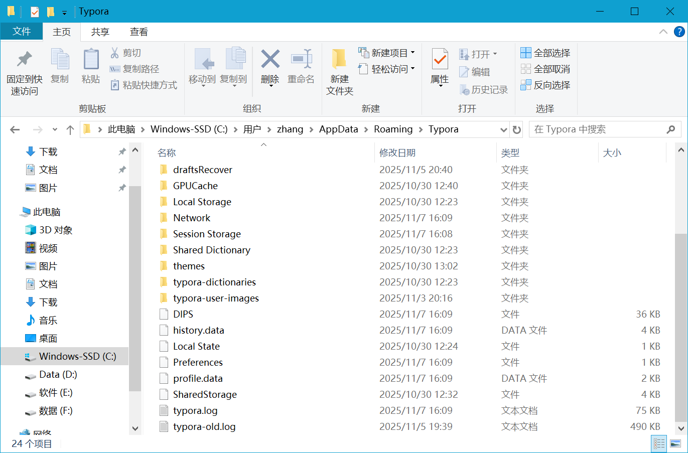
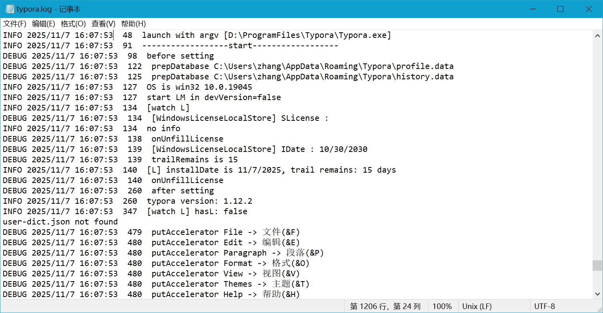
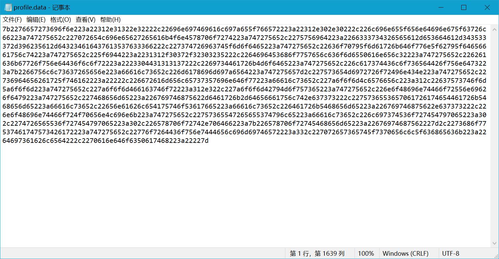
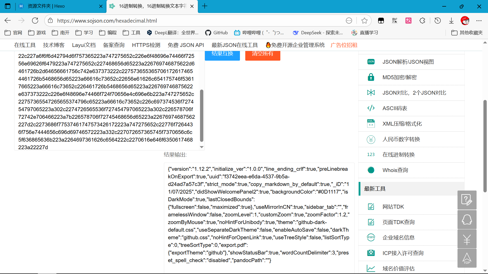

目前网上对 Typora 旧版本的破解或无限使用的方法大多已经失效，这里我列出这些旧版本的方法，并在最后给出一个新的方法，适用于 Typora 1.12.2 版本（目前最新版本）。未来 Typora 更新后，可能需要重新寻找新的方法。

## 旧版本方法

### 1.0.0 版本前

1.0.0 正式版之前的版本一直是免费的，可以免费使用。

### 1.9.5 版本及以前

1.9.5 之前的版本有下面两种方法，这个博客里都进行了详细介绍：

[手摸手教你安装激活最新的 Typora_typora 激活-CSDN 博客](https://blog.csdn.net/qq_37636739/article/details/136338284)

#### 破解

可以通过 inject Node.js 脚本来实现 hook 注册验证函数，从而实现假注册。

#### 无限试用

修改前端 js 代码，使已注册状态永真，从而实现无限试用。这种方式仍会弹窗提示未注册，但修改 html 代码可以强制关闭弹窗。

### 1.10.8 版本及以前

这些版本可以通过修改注册表记录的安装时间来实现无限试用。经过我的测试，最新的 1.12.2 版本已经无法使用这种方法，这中间的版本我没有进行测试。

[2025.5.26 Typora 1.10.8 破解（无限试用） - Jerrycyx - 博客园](https://www.cnblogs.com/jerrycyx/p/18896985)

## 新方法

对于 1.12.2 版本，我进行了一些简单的逆向分析，发现可以通过修改本地存储的注册状态来实现无限试用。这个方法可能也适用于 1.10.8 ~ 1.12.1 版本，我没有测试。未来这种方法可能会失效。

### 逆向过程介绍

逆向的过程其实挺简单，只能说 Typora 的保护还是有点弱。。。这里我先介绍一下之前的方法为什么失效了，然后介绍新的方法。

#### 旧方法失效分析

1. inject 法: inject 的方法失效原因我不清楚，可能是 Typora 修改了函数名，也可能是增加了防护措施，防止注入脚本。

2. 修改代码法: 修改代码法理论上是不可能失效的，因为它直接修改前端代码。但 Typora 估计也想到了这一点，所以它在启动时会校验前端代码的完整性，如果被修改了会直接退出。所以这种方法也失效了。

3. 修改注册表法: 修改注册表法失效的原因是 Typora 不再使用注册表来存储安装时间。虽然日志中仍然记录了它启动时读取注册表的时间，但实际上它已经不再使用注册表的记录来判断安装时间了。（遗留代码说是

哎，这里有机智的人会想了，它不在注册表里存安装时间，总得在**本地其他地方**存吧？没错，它和其他 Electron 应用一样，把数据存到了用户目录下的 `AppData\Roaming\Typora` 目录里。

#### 新方法实现

书接上文，我们想到了`AppData\Roaming\Typora` 目录，那我们就去看看吧。



这个目录下有很多文件和目录，但我们一眼看到了一个感兴趣的文件：`typora.log`。

**Typora 日志分析**

`typora.log` 是日志文件，记录了 Typora 的运行日志，里面有一些有用的信息，上文提到的注册表读取时间的日志也在这里面。我们从打开一次 Typora 的时间开始看日志。



看到了什么？[122]和[125] 进行了 prepDatabase，后面是`profile.data`和`history.data`。那这两个文件肯定不简单，我们稍后再说。

继续往下看日志，[134]在`[WindowsLicenseLocalStore]`中，读取了注册表记录的`SLicense`，发现是空的，于是在[138]-[140]调用`onUnfillLicense`，读取了注册表记录的`IDate`，是`10/30/2030`，日志当天是`11/07/2025`，下一行却说`trailRemains is 15`，说明它并没有使用注册表的安装时间来计算试用剩余时间。再看下一行，[140]打印了安装时间和剩余试用时间，安装时间是`11/7/2025`，剩余试用时间是 15 天，这是正确的。那么它到底是从哪里读取的安装时间呢？答案就藏在前面提到的两个文件里。

**history.data 和 profile.data 分析**

看名称，我们一定会迫不及待地打开`profile.data`，它最像是存储用户信息的文件。那我们就打开看看吧。



用记事本打开，发现有点奇怪：它是文本文件，却只有长长的一行数字和小写字母。**注意到**，它的字母只有`a-f`，说明它是某种数据转换成了十六进制字符串。我们打开一个[在线十六进制转文本的网站](https://www.sojson.com/hexadecimal.html)，把它转换回来看看。



结果非常的 Amazing 啊！转换出来的是一个 JSON 字符串，我们把它格式化一下看看。

```json
{
  "version": "1.12.2",
  "initialize_ver": "1.0.0",
  "line_ending_crlf": true,
  "preLinebreakOnExport": true,
  "uuid": "f3742eea-e6da-4537-9b5a-d24ad7a57c3f",
  "strict_mode": true,
  "copy_markdown_by_default": true,
  "_iD": "11/07/2025",
  "didShowWelcomePanel2": true,
  "backgroundColor": "#0D1117",
  "isDarkMode": true,
  "lastClosedBounds": { "fullscreen": false, "maximized": true },
  "useMirrorInCN": true,
  "sidebar_tab": "",
  "framelessWindow": false,
  "zoomLevel": 1,
  "customZoom": true,
  "zoomFactor": 1.2,
  "zoomByMouse": true,
  "noHintForUnibody": true,
  "theme": "github-dark-default.css",
  "useSeparateDarkTheme": false,
  "enableAutoSave": false,
  "darkTheme": "github.css",
  "noHintForOpenLink": true,
  "useTreeStyle": false,
  "listSortType": 0,
  "treeSortType": 0,
  "export.pdf": { "exportTheme": "github" },
  "showStatusBar": true,
  "wordCountDelimiter": 3,
  "preset_spell_check": "disabled",
  "pandocPath": ""
}
```

看到什么了？`"_iD": "11/07/2025"`，这不就是安装时间吗？没错，这个文件里存储了 Typora 的安装时间。

接下来就好办了，我们只需要把`_iD`字段修改成当天时间，然后转回十六进制字符串，覆盖回`profile.data`文件，即可实现重置安装时间，从而实现无限试用。此外，我还尝试修改为未来的日期和 15 天前的日期，结果 Typora 显示试用时间结束，说明这个方法是有效的。

> `history.data`的存储方式和`profile.data`一样，只不过它存储的是打开过的文件等历史记录信息，解析留给大家作为练习。

**脚本实现**

为了方便使用，我们直接速写一个小脚本，打包成可执行文件，将快捷方式放到`「开始」菜单\程序\启动`文件夹，即可实现开机自动执行一次，从而实现每天重置安装时间，达到无限试用的目的。

```python
from __future__ import annotations

import binascii
import json
import os
import sys
from datetime import datetime
from pathlib import Path
from typing import Tuple


def _read_profile(profile_path: Path) -> Tuple[dict, str, bool, str]:
    raw_content = profile_path.read_text(encoding="utf-8")
    if not raw_content.strip():
        raise ValueError("profile.data is empty")

    hex_payload = "".join(raw_content.split())
    try:
        payload_bytes = binascii.unhexlify(hex_payload)
    except binascii.Error as exc:
        raise ValueError("profile.data does not contain valid hex data") from exc

    for codec in ("utf-8", "utf-16-le", "utf-16"):
        try:
            profile_text = payload_bytes.decode(codec)
            break
        except UnicodeDecodeError:
            continue
    else:
        raise UnicodeDecodeError(
            "profile.data", payload_bytes, 0, len(payload_bytes), "Unable to decode profile content"
        )

    profile_json = json.loads(profile_text)
    has_crlf = raw_content.endswith("\r\n")
    return profile_json, hex_payload, has_crlf, raw_content


def _write_profile(
    profile_path: Path, data: dict, original_hex: str, has_crlf: bool, original_raw: str
) -> None:
    updated_text = json.dumps(data, ensure_ascii=False, separators=(",", ":"))
    payload_bytes = updated_text.encode("utf-8")
    hex_payload = binascii.hexlify(payload_bytes).decode("ascii")
    if original_hex.isupper():
        hex_payload = hex_payload.upper()
    newline = "\r\n" if has_crlf else ("\n" if original_raw.endswith("\n") else "")
    profile_path.write_text(hex_payload + newline, encoding="utf-8")


def _update_profile_id(profile_json: dict) -> None:
    today = datetime.now().strftime("%m/%d/%Y")
    profile_json["_iD"] = today


def _resolve_profile_path() -> Path:
    appdata = os.environ.get("APPDATA")
    if not appdata:
        raise EnvironmentError("APPDATA environment variable is not set")
    profile_path = Path(appdata) / "Typora" / "profile.data"
    if not profile_path.exists():
        raise FileNotFoundError(f"Profile file not found: {profile_path}")
    return profile_path


def main() -> int:
    profile_path = _resolve_profile_path()
    profile_json, original_hex, has_crlf, original_raw = _read_profile(profile_path)
    _update_profile_id(profile_json)
    _write_profile(profile_path, profile_json, original_hex, has_crlf, original_raw)
    return 0


if __name__ == "__main__":
    try:
        sys.exit(main())
    except Exception as exc:  # pragma: no cover
        print(f"Error: {exc}", file=sys.stderr)
        sys.exit(1)

```

**打包**

```pwsh
pyinstaller.exe --onefile TyporaTrial.py
```

**注册为开机执行一次**

将下面的批处理脚本保存为 xxx.bat，与 TyporaTrial.exe 放在同一目录下，双击运行即可将快捷方式创建到`「开始」菜单\程序\启动`文件夹中，实现开机自动执行。

```bat
@echo off
setlocal
set "SCRIPT_DIR=%~dp0"
if "%SCRIPT_DIR:~-1%"=="\" set "SCRIPT_DIR=%SCRIPT_DIR:~0,-1%"
set "TARGET=%SCRIPT_DIR%\TyporaTrial.exe"
if not exist "%TARGET%" (
    echo TyporaTrial.exe not found in %SCRIPT_DIR%
    exit /b 1
)
for %%I in ("%TARGET%") do set "TARGET=%%~fI"
set "STARTUP_DIR=%APPDATA%\Microsoft\Windows\Start Menu\Programs\Startup"
if not exist "%STARTUP_DIR%" (
    echo Startup folder not found: %STARTUP_DIR%
    exit /b 1
)
set "LINK=%STARTUP_DIR%\TyporaTrial.lnk"
powershell -NoProfile -Command "$ws = New-Object -ComObject WScript.Shell; $s = $ws.CreateShortcut('%LINK%'); $s.TargetPath = '%TARGET%'; $s.WorkingDirectory = '%SCRIPT_DIR%'; $s.Save()" >nul
if not exist "%LINK%" (
    echo Failed to create startup shortcut.
    set "EXIT_CODE=1"
    goto end
)
echo Created shortcut %LINK% pointing to %TARGET%.
set "EXIT_CODE=0"
goto end

:end
if not defined EXIT_CODE set "EXIT_CODE=1"
echo.
pause
exit /b %EXIT_CODE%

```

**弹窗关闭**

由于不能再通过修改前端代码来关闭未注册弹窗，我们可以直接用杀毒软件的弹窗拦截等功能来关闭弹窗，或者使用其他工具脚本等。

## 结语

通过分析 Typora 的日志文件和本地存储文件，我们成功找到了实现无限试用的方法。希望这个方法对大家有所帮助。当然，支持正版软件是最好的选择，如果你觉得 Typora 好用，建议购买正版许可证。
