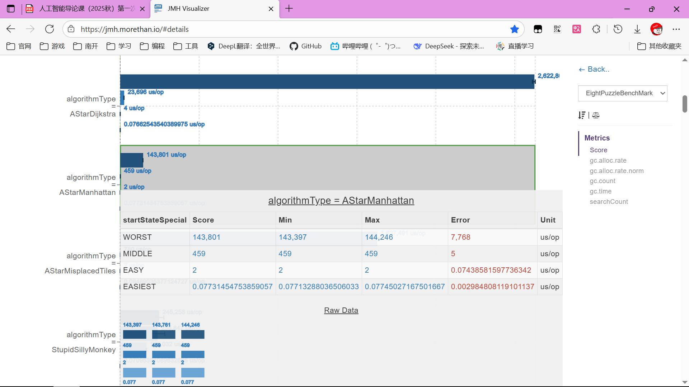
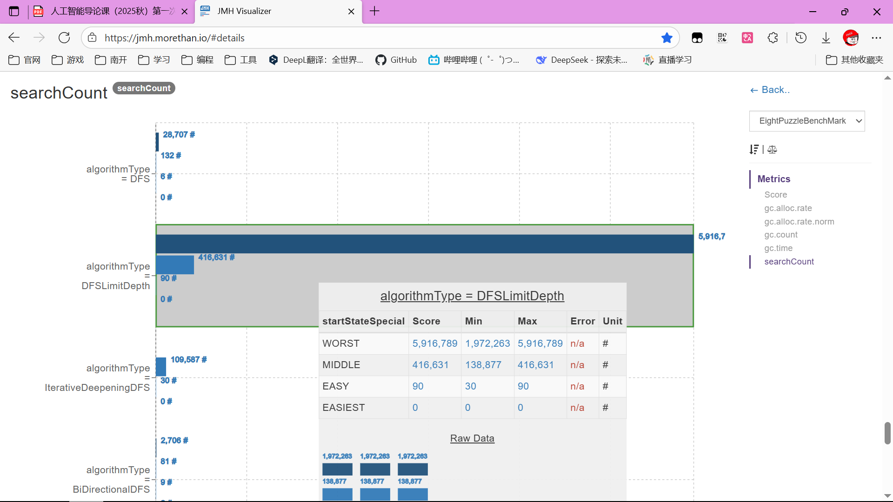
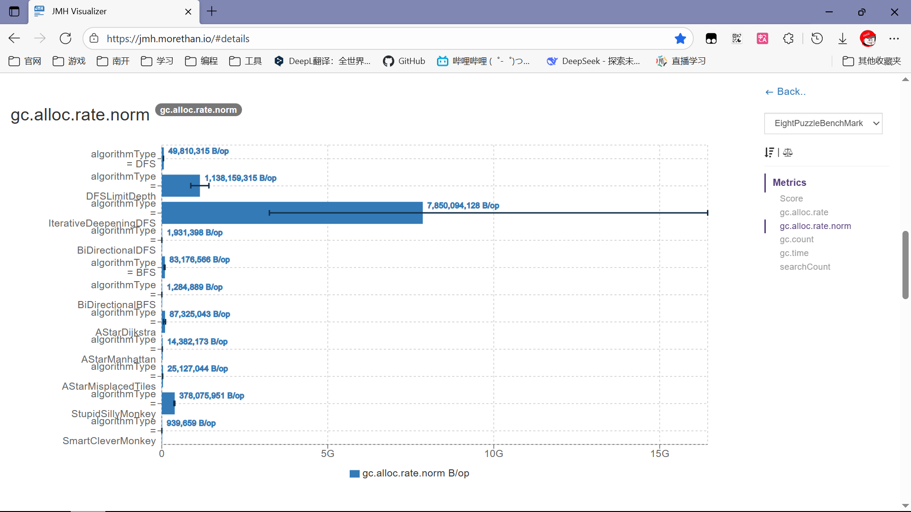
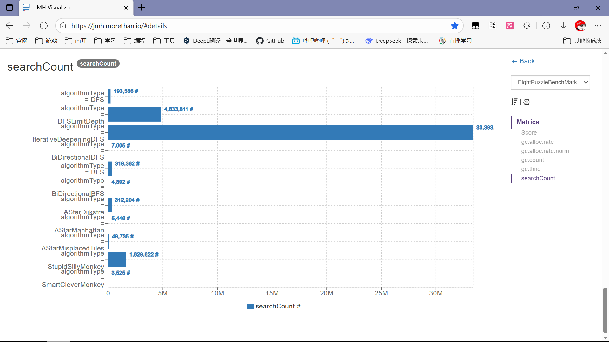

八数码问题是一个经典的人工智能搜索问题，通常用于测试和比较各种搜索算法的性能。本文介绍多种求解八数码问题的算法，并通过实验对它们进行了性能评估。

本篇文章的代码已上传至 GitHub，包含所有实现的算法、基准测试代码、实验源数据和简化的可读数据。欢迎访问并参考：[八数码问题求解算法](https://github.com/njdldkl666699/njdldkl666699.github.io/blob/main/source/_posts/八数码问题求解算法/)下文所有链接均指向该代码仓库中的相关文件。

## 算法思路简介

本节简要介绍各个算法的基本思路和实现方法。首先，我们对状态进行定义，然后介绍各种搜索算法的实现。

状态类[State.java](https://github.com/njdldkl666699/njdldkl666699.github.io/blob/main/source/_posts/八数码问题求解算法/NPuzzle/src/main/java/io/njdldkl/State.java)定义了八数码问题的状态表示和基本操作，包括获取后继状态等功能。状态由一个 n\*n 的二维 byte 数组表示，空格用 0 表示。这样做可以节省内存空间，并且天然支持拓展到更大的 n\*n 问题。

### 广度优先搜索（BFS）

[BFS.java](https://github.com/njdldkl666699/njdldkl666699.github.io/blob/main/source/_posts/八数码问题求解算法/NPuzzle/src/main/java/io/njdldkl/algorithm/BFS.java) 使用队列（Queue）实现。从初始状态开始，将其加入队列。每次从队列头部取出一个状态，检查是否为目标状态。如果不是，则将其所有未访问过的后继状态加入队列尾部。使用哈希表记录已访问状态及其路径长度，避免重复访问和死循环。由于 BFS 是按层级进行扩展的，因此在边权一致（均为 1）的情况下，它保证能找到从起始状态到目标状态的最短路径。然而，BFS 的主要缺点是空间复杂度较高，随着搜索深度的增加，需要存储的状态数量呈指数级增长，容易导致内存溢出。

### 双向广度优先搜索（Bi-BFS）

[BiDirectionalBFS.java](https://github.com/njdldkl666699/njdldkl666699.github.io/blob/main/source/_posts/八数码问题求解算法/NPuzzle/src/main/java/io/njdldkl/algorithm/BiDirectionalBFS.java) 同时从起始状态和目标状态进行广度优先搜索。维护两个队列和两个访问记录表（分别记录从起点和终点出发到达该状态的步数）。每次交替从两个方向各扩展一层。当一个方向扩展出的状态在另一个方向的访问记录中出现时，说明路径交汇，搜索成功，总步数为两个方向步数之和。相比于单向 BFS，双向 BFS 能够显著减少搜索空间。假设分支因子为 $ b $，解的深度为 $ d $，单向 BFS 需要搜索 $ b^d $ 个节点，而双向 BFS 只需要搜索 $ 2 \times b^{d/2} $ 个节点，这在深度较大时优势非常明显。

### 深度优先搜索（DFS）

[DFS.java](https://github.com/njdldkl666699/njdldkl666699.github.io/blob/main/source/_posts/八数码问题求解算法/NPuzzle/src/main/java/io/njdldkl/algorithm/DFS.java) 使用栈（Stack）实现非递归版本，以防止深层递归导致栈溢出。从初始状态开始，将其压入栈。每次弹出栈顶状态，检查是否为目标。如果不是，将其未访问过的后继状态压入栈中。使用集合记录已访问状态，防止重复处理。DFS 的优点是空间消耗相对较小，因为它只需要存储当前路径上的节点。但是，DFS 不保证找到最短路径，而且在搜索空间深度很大或无限时，可能会陷入深层分支而无法返回（即“不完备”），导致长时间找不到解。

### 深度限制搜索（DLS）

[DFSLimitDepth.java](https://github.com/njdldkl666699/njdldkl666699.github.io/blob/main/source/_posts/八数码问题求解算法/NPuzzle/src/main/java/io/njdldkl/algorithm/DFSLimitDepth.java) 是一种限制搜索深度的深度优先搜索。在递归进行 DFS 时，增加一个深度参数。当深度达到预设的限制（`depthLimit`）时，即使未找到目标也停止继续向下搜索并回溯。这可以避免 DFS 在无限深度的分支中迷失。然而，DLS 的效果高度依赖于深度限制的选择：如果限制太小，可能无法搜索到目标状态（不完备）；如果限制太大，则退化为普通 DFS，且仍然可能包含大量无效搜索。

### 迭代加深搜索（IDDFS）

[IterativeDeepeningDFS.java](https://github.com/njdldkl666699/njdldkl666699.github.io/blob/main/source/_posts/八数码问题求解算法/NPuzzle/src/main/java/io/njdldkl/algorithm/IterativeDeepeningDFS.java) 结合了 DFS 的空间优势和 BFS 的完备性。从小到大逐渐增加深度限制（`maxDepth`），每次都进行一次深度限制搜索（DLS）。虽然会重复搜索浅层节点，但保证了能找到最短路径（在边权为 1 时），且空间复杂度优于 BFS。由于搜索树的节点数量随着深度呈指数增长，底层节点的数量远多于上层节点，因此重复搜索浅层节点带来的额外时间开销相对于总时间来说是可以接受的。

### 双向深度优先搜索（Bi-DFS）

[BiDirectionalDFS.java](https://github.com/njdldkl666699/njdldkl666699.github.io/blob/main/source/_posts/八数码问题求解算法/NPuzzle/src/main/java/io/njdldkl/algorithm/BiDirectionalDFS.java) 类似于双向 BFS，但使用栈进行深度优先遍历。维护两个栈和两个访问集合。同时记录每个节点的父节点以便回溯路径。当两个方向的搜索相遇（即当前节点已被另一方向访问过）时，通过记录的父节点指针回溯计算路径长度。虽然双向策略试图减少搜索深度，但由于 DFS 的性质，两个方向的搜索可能会在非最优的位置相遇，因此双向 DFS 找到的路径通常不是最短路径，且其性能波动较大，依赖于搜索的具体路径。

### A\* 搜索算法

[AStar.java](https://github.com/njdldkl666699/njdldkl666699.github.io/blob/main/source/_posts/八数码问题求解算法/NPuzzle/src/main/java/io/njdldkl/algorithm/AStar.java) 使用优先队列（PriorityQueue）实现。根据估价函数 $f(n) = g(n) + h(n)$ 对状态进行排序，优先扩展 $f(n)$ 最小的状态。其中 $g(n)$ 是从起始状态到当前状态的实际代价，$h(n)$ 是从当前状态到目标状态的估计代价。算法维护一个 Open List（优先队列）存放待扩展节点，和一个 Closed List（哈希集合）存放已访问节点。A\* 算法的性能和最优性很大程度上取决于启发式函数 $h(n)$ 的设计。如果 $h(n)$ 是可采纳的（即不超过实际代价），A\* 保证能找到最短路径。

#### Dijkstra

当 A\* 算法的启发式函数设为 $h(n) = 0$ 时，即为 Dijkstra 算法。它仅根据实际代价 $g(n)$ 进行搜索。在八数码问题中，每一步代价为 1，此时 Dijkstra 算法的行为退化为广度优先搜索（BFS）。它保证找到最优解，但由于缺乏启发信息的引导，搜索会向所有方向均匀扩散，搜索范围通常较大，效率较低。

#### 曼哈顿距离

启发式函数计算所有数字当前位置与目标位置的曼哈顿距离（横纵坐标差的绝对值之和）的总和。这是一种可采纳（Admissible）且一致（Consistent）的启发式函数。相比于错位数字数量，曼哈顿距离提供了更丰富的梯度信息，能够更准确地引导搜索方向，因此通常具有更高的搜索效率，扩展的节点数更少。

#### 错位数字数量

启发式函数计算当前状态中与目标状态位置不一致的数字个数。这也是一种可采纳的启发式函数。然而，它的估计值通常比曼哈顿距离更小（更宽松），区分度较低。这意味着会有更多的节点具有相同的 $f(n)$ 值，导致 A\* 算法在这些节点间进行更多的盲目搜索，因此效率通常低于使用曼哈顿距离。

### 随机算法

[Monkey.java](https://github.com/njdldkl666699/njdldkl666699.github.io/blob/main/source/_posts/八数码问题求解算法/NPuzzle/src/main/java/io/njdldkl/algorithm/Monkey.java) 模拟随机游走策略，用于作为性能基准的下限对照。

#### 愚蠢的猴子

完全随机选择下一个状态。它不记录已访问过的状态，可能会在原地打转或陷入死循环。虽然理论上在无限时间内可能找到解（概率为 1），但实际效率极低，通常无法在合理时间内解决问题。这种算法模拟了完全无记忆的随机过程。

#### 聪明的猴子

在随机选择时，会使用哈希集合记录已访问过的状态。在选择后继状态时，只从那些未被访问过的后继中随机选择。这种方法避免了重复路径，但是在寻找后继节点时没有考虑后继节点是否已访问。相比“愚蠢的猴子”，它几乎找不到解，很容易陷入死胡同，效率仍然非常低。

## 实验测试结果与分析

我对上述所有算法进行了多种测试，包括算法正确性测试和性能测试。下面对两种测试方法进行简要说明。

### 算法正确性测试

[FactoryTest.java](https://github.com/njdldkl666699/njdldkl666699.github.io/blob/main/source/_posts/八数码问题求解算法/NPuzzle/src/test/io/njdldkl/FactoryTest.java) 包含了对各个算法的正确性测试。测试的目的是验证各个算法在一些特殊状态下是否能正确找到解，并且解的步数是否符合预期，以及算法探索了多少状态后结束。

预定义的特殊起始状态[StartStateSpecial.java](https://github.com/njdldkl666699/njdldkl666699.github.io/blob/main/source/_posts/八数码问题求解算法/NPuzzle/src/main/java/io/njdldkl/benchmark/StartStateSpecial.java)包括：

1. 最坏状态(WORST)：需要最多步数才能到达目标状态的起始状态。经过查阅资料，八数码问题的最坏情况状态需要 31 步才能到达目标状态。
2. 中间状态(MIDDLE)：需要 15 步到达目标状态的起始状态。中间状态可以通过从目标状态反向移动 15 步得到，注意每次移动时选择一个合法的随机后继状态，需要记录已访问状态以防止回到上一步状态。
3. 简单状态(EASY)：仅差 2 步即可到达目标状态的起始状态。
4. 目标状态(EASIEST)：起始状态即为目标状态。

经过初期测试，大部分算法都能正确解决上述特殊状态，且符合算法的预期表现。例如，BFS 和 A\* 能够找到最短路径，而 DFS 能找到解，但一般找不到最短路径。其中特别需要注意的是 IDDFS，它在最坏状态测试中运行了 1 分 30 秒后才找到解，表现出其在深度较大时的效率问题。因此，在后续的性能测试中，我没有包含 IDDFS 算法在最坏情况下的测试。

### 性能测试

性能测试使用了[JMH (Java Microbenchmark Harness)](https://github.com/openjdk/jmh) 框架进行基准测试。基准测试[EightPuzzleBenchmark.java](https://github.com/njdldkl666699/njdldkl666699.github.io/blob/main/source/_posts/八数码问题求解算法/NPuzzle/src/main/java/io/njdldkl/benchmark/EightPuzzleBenchmark.java)包含两部分，分别是特殊状态的性能测试和随机状态的性能测试。下面对实验的介绍不讨论 JMH 的使用细节，主要介绍测试设计思路。

性能测试主要记录的结果是算法运行的平均性能指标，包括：

1. 执行时间 us/op （微秒/每次操作）
2. 内存使用量 B/op （字节/每次操作）
3. 搜索的状态数量 #/op （个/每次操作）

#### 特殊状态性能测试

特殊状态性能测试使用了与正确性测试相同的四个预定义起始状态（WORST、MIDDLE、EASY、EASIEST）。每个算法在每个状态下运行 3 轮、每轮不停地执行算法 10 秒（会执行若干次）。

实验结束后，JMH 会生成详细的性能报告(.json)，我们将报告使用[JMH Visualizer](https://jmh.morethan.io/) 进行可视化，方便对比各个算法在不同状态下的性能表现。以下是部分实验结果截图，以及更加可读的简化表格形式结果。此处仅展示部分算法的最坏状态的结果，完整结果见实验数据[benchmarkAlgorithm_readable.json](https://github.com/njdldkl666699/njdldkl666699.github.io/blob/main/source/_posts/八数码问题求解算法/data/benchmarkAlgorithm_readable.json)。

| 算法                | 起始状态 | 时间(us/op) | 内存(B/op)   | 搜索状态(#/op) |
| ------------------- | -------- | ----------- | ------------ | -------------- |
| DFS                 | WORST    | 8862.97     | 7131774.34   | 9569.0         |
| BFS                 | WORST    | 1000166.30  | 138544546.66 | 181438.0       |
| BiDirectionalBFS    | WORST    | 12512.16    | 7613160.96   | 9634.0         |
| AStarManhattan      | WORST    | 143801.13   | 154695222.17 | 15337.0        |
| AStarMisplacedTiles | WORST    | 1627490.81  | 190756816.76 | 125151.0       |
| StupidSillyMonkey   | WORST    | 245258.14   | 338247358.67 | 499916.33      |

从数据中可以看到，A\* 曼哈顿距离在最坏情况下的性能也相当优秀，而 DFS 和 双向 BFS 在最坏情况下很快，分别是因为 DFS 找不到最优解、BiBFS 搜索两端结果很快。

#### 随机状态性能测试

测试方法是每轮开始前从目标状态出发，随机游走 32 步得到本轮的起始状态，在一轮的每次执行开始前，得到该状态的一个随机后继状态作为本次执行的起始状态，并更新本轮起始状态为该后继状态。每个算法执行 3 轮、每轮不停地执行算法 5 分钟。

实验结果截图如下，以及更加可读的简化表格形式结果，展示所有算法的平均结果。源数据见附录实验数据[benchmarkAlgorithmRandom_readable.json](https://github.com/njdldkl666699/njdldkl666699.github.io/blob/main/source/_posts/八数码问题求解算法/data/benchmarkAlgorithmRandom_readable.json)。

| 算法                  | 时间(us/op) | 内存(B/op)    | 搜索状态(#/op) |
| --------------------- | ----------- | ------------- | -------------- |
| DFS                   | 161228.78   | 49810315.12   | 64528.63       |
| DFSLimitDepth         | 1030870.59  | 1138159314.77 | 1611270.38     |
| IterativeDeepeningDFS | 6972699.30  | 7850094127.91 | 11131215.27    |
| BiDirectionalDFS      | 2540.48     | 1931398.49    | 2335.09        |
| BFS                   | 514509.11   | 83176566.46   | 106120.79      |
| BiDirectionalBFS      | 1539.30     | 1284888.63    | 1630.64        |
| AStarDijkstra         | 1300643.82  | 87325042.98   | 104067.91      |
| AStarManhattan        | 12406.40    | 14382172.95   | 1815.46        |
| AStarMisplacedTiles   | 121149.05   | 25127043.74   | 16578.34       |
| StupidSillyMonkey     | 280430.77   | 378075951.35  | 543207.17      |
| SmartCleverMonkey     | 831.12      | 939659.42     | 1174.92        |

从数据可以看到，在找到最优解的算法里，A\* 曼哈顿距离表现最好，搜索状态数最少，时间和内存也最低。在能找到可行解的算法里，双向 DFS 和双向 BFS 表现相当好，这可能是因为随机状态处于较为居中的位置，充分发挥了双向搜索的优势。

## 总结

通过对上述多种搜索算法在八数码问题上的实现与测试，我们可以得出以下结论：

1. **算法完备性与最优性**：

   - **BFS**、**Bi-BFS**、**IDDFS** 和 **A\*** 算法都是完备的，只要有解就能找到。同时，在八数码问题（边权为 1）中，它们都能保证找到最短路径（最优解）。
   - **DFS** 及其变种（如 **Bi-DFS**）虽然空间占用小，但不保证找到最短路径，且容易陷入深层搜索，效率极不稳定。
   - **随机算法**（猴子算法）仅作为对照，效率极低且不具备实用性。

2. **搜索效率对比**：
   - **启发式搜索 (A\*)** 表现最佳。其中，曼哈顿距离作为启发式函数，比错位数字数量更具区分度，能更效地引导搜索方向，从而大幅减少扩展的节点数。
   - **双向搜索**（如 **Bi-BFS**）通常优于单向搜索。过从起点和终点同时搜索，能够显著减小搜索树的规模（指级减少）。
   - **盲目搜索**（BFS, DFS）在状态空间较大时效率低。BFS 虽然能找到最优解，但内存消耗巨大；DFS 虽然节省内存，但时间开销不可控。

综上所述，对于八数码这类状态空间较大且需要寻找最优解的问题，A\* 算法配合优秀的启发式函数（如曼哈顿距离）是首选方案。如果只需要找到可行解且内存受限，双向搜索（如 Bi-BFS）是一个可靠的替代选择。

做完八数码实验后，我对 15 数码进行了初步的探索。然而，15 数码的状态空间远远大于八数码（16 的阶乘对计算机的内存来说是一个天文数字），A\*算法也没在 1 分钟内找到最优解，且遇到了内存溢出的问题。此外，我还了解了 IDA\*算法（迭代加深 A\*），它结合了 A\*的启发式搜索和 IDDFS 的空间效率，适用于更大规模的问题，但在我的实验环境中仍未能成功运行。

总之，通过本次实验，我深入理解了多种搜索算法的原理及其在实际问题中的应用效果，尤其是启发式搜索在解决复杂问题时的优势。这为我今后在人工智能领域的学习和研究打下了坚实的基础。
