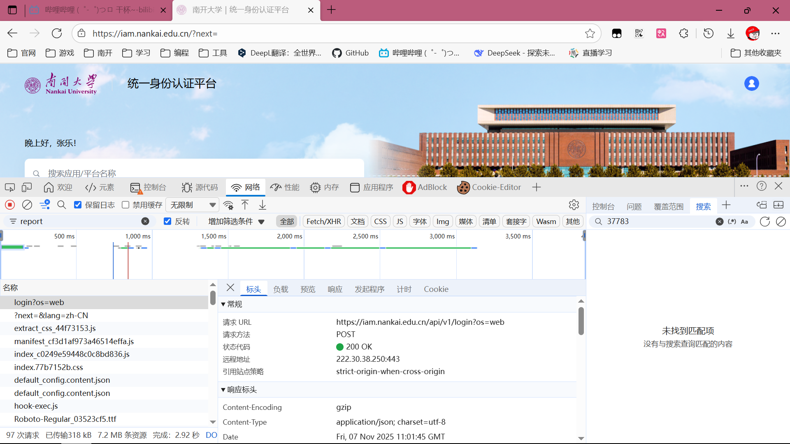
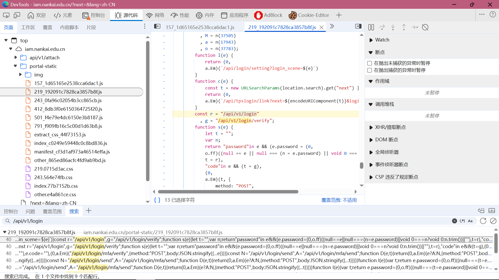
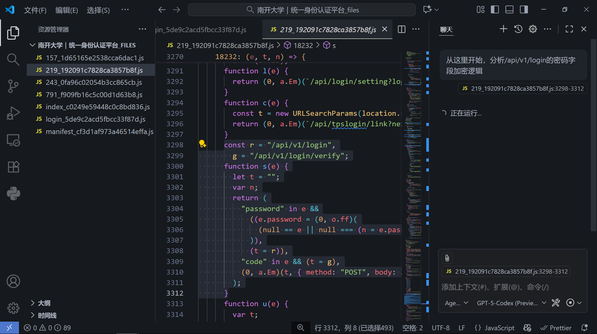

这篇博客我们来点~~刺激~~有趣的，逆向一下[南开大学统一身份认证平台](https://iam.nankai.edu.cn/)登录接口。

## 免责声明

本文仅供学习和研究使用，请勿用于非法用途，否则后果自负。本文仅涉及前端逻辑逆向，在实际生产环境中，登录接口还涉及后端验证和 SSL 等安全措施，本文不可能也不会绕过这些安全措施。

## 逆向分析

### 网络请求分析

我们进入登录页面，打开浏览器开发者工具，输入信息后点击登录按钮，观察网络请求。可以看到有一个 `https://iam.nankai.edu.cn/api/v1/login?os=web POST` 请求，这就是登录接口。



请求体包含以下参数：

```json
{
  "login_scene": "feilian",
  "account_type": "userid",
  "account": "*******", // 账号，已隐藏
  "password": "5adaf8de8e7c4f****54817ac2787138" // 加密的密码，已隐藏部分
}
```

可以看到，密码并不是明文传输的，而是经过加密处理的。下面我们就来逆向这个加密过程。

### 前端代码分析

我们在浏览器开发者工具中，切换到`源代码`选项卡，在`iam.nankai.edu.cn/portal-static/`目录下，搜索`/api/v1/login`，找到调用登录接口的代码文件和位置。



这里我们找到了调用登录接口的代码片段，发现`e`这个对象包含了密码字段，以及调用了一个名为`o.ff`的函数对密码进行了处理。

```js
const r = "/api/v1/login",
  g = "/api/v1/login/verify";
function s(e) {
  let t = "";
  var n;
  return (
    "password" in e &&
      ((e.password = (0, o.ff)((null == e || null === (n = e.password) || void 0 === n ? void 0 : n.trim()) || "")),
      (t = r)),
    "code" in e && (t = g),
    (0, a.Em)(t, {
      method: "POST",
      body: JSON.stringify({
        ...e,
        account: e.account.trim(),
      }),
    })
  );
}
```

### AI 分析

有了这些信息，我们可以请 AI 登场了，让它帮我们分析。保存源代码选项卡中的所有`.js`文件，然后用 AI 进行分析。



`GPT-5-Codex`很快分析出来了，密码加密逻辑如下：

- 在 `s()` 提交 `/api/v1/login` 时，如果包含 `password` 字段，会先对密码做 `trim()`，然后调用 `(0, o.ff)(…)` 把明文替换成加密结果。
- `ff()`（模块 `37783` 中导出的 `h`）使用 CryptoJS 做 AES-CBC 加密：先取 `Number.MAX_SAFE_INTEGER.toString()` 做 MD5 得到固定字符串，再用它派生 AES 密钥；同一结果经 SHA1 生成 IV。
- 最终通过 `CryptoJS.AES.encrypt(密码, key, { iv, mode: CBC, padding: Pkcs7 })` 得到密文，转为十六进制字符串放到请求体里，连同去空格后的账号一起提交。

下面给出加密解密的代码，供大家参考：

```js
const CryptoJS = require("crypto-js");

function deriveKeyMaterials() {
  const seed = Number.MAX_SAFE_INTEGER.toString();
  const keyString = CryptoJS.MD5(seed).toString();
  // Mirror the front-end's MD5-then-SHA1 key and IV derivation
  const key = CryptoJS.enc.Utf8.parse(keyString);
  const ivHex = CryptoJS.SHA1(CryptoJS.enc.Utf8.parse(keyString)).toString(CryptoJS.enc.Hex);
  const iv = CryptoJS.enc.Utf8.parse(ivHex);
  return { key, iv };
}

function encryptPassword(plainText) {
  const trimmed = (plainText || "").trim();
  const { key, iv } = deriveKeyMaterials();
  const ciphertext = CryptoJS.AES.encrypt(trimmed, key, {
    iv,
    mode: CryptoJS.mode.CBC,
    padding: CryptoJS.pad.Pkcs7,
  }).ciphertext.toString(CryptoJS.enc.Hex);
  return ciphertext;
}

function decryptPassword(cipherHex) {
  const { key, iv } = deriveKeyMaterials();
  const cipherParams = CryptoJS.lib.CipherParams.create({
    ciphertext: CryptoJS.enc.Hex.parse(cipherHex || ""),
  });
  const plaintext = CryptoJS.AES.decrypt(cipherParams, key, {
    iv,
    mode: CryptoJS.mode.CBC,
    padding: CryptoJS.pad.Pkcs7,
  }).toString(CryptoJS.enc.Utf8);
  return plaintext;
}

if (require.main === module) {
  const sample = "Password123!";
  const encrypted = encryptPassword(sample);
  const decrypted = decryptPassword(encrypted);
  console.log("Plaintext :", sample);
  console.log("Encrypted :", encrypted);
  console.log("Decrypted :", decrypted);
}

module.exports = { encryptPassword, decryptPassword };
```

运行结果如下：

```
Plaintext : Password123!
Encrypted : 2b0164131b374d2e166ca316cf310021
Decrypted : Password123!
```

## 总结

通过这次逆向分析，我们成功还原了南开大学统一身份认证平台的登录密码加密逻辑。实际上，这种前端加密方式在 HTTP 网络中并不安全，因为加密密钥和 IV 都存储在前端代码中，攻击者可以轻易获取并破解密码。

在实际生产环境中，建议使用 HTTPS 来保护数据传输的安全性，后端一旦收到密码，立即进行 SHA256 等强哈希算法并加盐存储，而不是依赖前端加密来保护密码安全。
